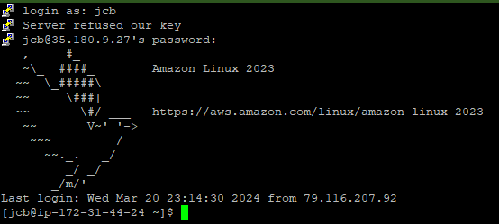

# AWS Linux Server DevOps

Following the instructions of the exersice at: [devopsrealtime.com](https://devopsrealtime.com/fun-with-linux-for-cloud-devops-engineers/)

## Create Linux based EC2 instance

1. Go to AWS Management Console and click on EC2.
2. Click on Launch Instance.
3. Amazon Linux Quick Start.
4. Create a new key pair and download it. I prefer to use a pkk key to easy connect to the instance with putty.
5. Launch the instance.

   

6. Open a terminal and connect to the instance using the pem key and the public DNS of the instance.

   

## Linux Commands

### Create users and groups as '**super user**'

1. Create users and set passwords

   `adduser jcb`

   `passwd jcb`

   Repeat the process for the other users.

   `adduser jcb2`

   `passwd jcb2`

   `adduser jcb3`

   `passwd jcb3`

2. Create Groups – devops, aws

   `groupadd devops`

   `groupadd aws`

   

3. Change primary group of user2, user3 to ‘devops’ group

   `usermod -g devops jcb2`

   `usermod -g devops jcb3`

4. Add ‘aws’ group as secondary group to the ‘user1’

   `usermod -a -G aws jcb`

   

5. Create the folowing directories

   

   We can create multiple directories with only one command.

   -p to create the parent directories if they don't exist.

   Remember to create the directories in / directory.
   You can change to root the following command: `cd /`
   
   To create all the directories we can use the following command:

   `mkdir -p home dir1 dir2/dir1/dir2/dir10 dir3/dir11 dir4/dir12 dir5/dir13 dir6 dir7/dir10 dir8/dir9 opt/dir14/dir10`

   Now we can create the files in the directories.

   `touch /f1 /f2`

   `touch /dir1/f1`

   `touch /dir2/dir1/dir2/f3`

   `touch /dir4/dir12/f4`

   `touch /dir4/dir12/f5`

   `touch /dir7/dir10/f3`

   `touch /opt/dir14/f3`

   

6. Change group of /dir1, /dir7/dir10, /f2 to “devops” group

   `chgrp devops /dir1`

   `chgrp devops /dir7/dir10`

   `chgrp devops /f2`

   

7. Change ownership of /dir1, /dir7/dir10, /f2 to “user1” user.

   `chown jcb /dir1`

   `chown jcb /dir7/dir10`

   `chown jcb /f2`

   

### Create users as '**user1**'

We need to change sshd_config file to allow that user to login. Edit /etc/ssh/sshd_config file and change `PasswordAuthentication no` to `PasswordAuthentication yes`.
Restart the sshd service with the following command: `sudo service sshd restart`

We also need to add the user to the sudoers file and add permissions. Edit the file with the following command: `visudo` and add the following line at the end of the file:
`jcb ALL=(ALL) NOPASSWD: /usr/sbin/useradd, /usr/bin/passwd, /usr/sbin/groupadd, /usr/sbin/usermod, /usr/bin/chgrp, /usr/bin/chown, /usr/bin/mkdir, /usr/bin/touch, /usr/bin/mv, /usr/bin/rm, /usr/bin/ls`

Now we can login as user1 and create the users, groups, change groups, create and remove directories and files, etc. You can adapt the necessary commands to the user1 permissions.

### Login as '**user1**'

1. Create users and set passwords – user4, user5

   `sudo useradd jcb4`

   `sudo passwd jcb4`

   `sudo useradd jcb5`

   `sudo passwd jcb5`

2. Create Groups – app, database

   `sudo groupadd app`

   `sudo groupadd database`

### Login as '**user4**'

Before user4 login we need to add permissions to the user to execute commands in some directories.

Change the directory permissions, we need jcb4 user to have write permissions.

We can use the following command as root user: `chmod o+w dir6`
"o" is for others, "w" is for write.

Also we need to write permissions to the file f3 on root directory. We can use the following command: `chmod o+w /`

We need permisions to move files from one directory to another. We can use the following commands:

`chmod o+w /dir2/dir1/dir2`

`chmod o+w /dir1`

`chmod o+w /f2`

Login as user4 with putty.

1. Create directory – /dir6/dir4

   `mkdir -p /dir6/dir4`

2. Create file – /f3

   `touch /f3`

3. Move the file from "/dir1/f1" to "/dir2/dir1/dir2"

   `mv /dir1/f1 /dir2/dir1/dir2`

4. Rename the file "/f2 to /f4"

   `mv /f2 /f4`

   

   

### Login as '**user1**'

In this section we need to create a directory in user2 home directory. We need to change the permissions of the directory to allow user1 to write in it.

Login as user2 with putty and grant write permissions to the directory. We are in the home directory of user2.

`chmod o+rwx .`

We can use the following command: `chmod o+w /home/jcb2/dir1`

Also grant permissions to create files in the directory of the second exercise.

`chmod o+w /opt/dir14/dir10`

To delete the directory recursively we need to grant permissions to the directory.

We can do it recursively with the following command:

`chmod -R o+w /dir4`

For exercise 5 we need to grant permissions to the directory.

`chmod -R o+w /opt/dir14`

For exercise 6 we need to grant permissions with user4 to write in the file f3.

`chmod o+w /f3`

1. Create directory – “/home/user2/dir1”

   `mkdir -p /home/jcb2/dir1`

   

2. Change to “/dir2/dir1/dir2/dir10” directory and create file “/opt/dir14/dir10/f1” using relative path method.

   `cd /dir2/dir1/dir2/dir10`

   Remember, we need to go back 4 levels to create the file in the correct directory.

   `touch ../../../../opt/dir14/dir10/f1`

   

3. Move the file from “/opt/dir14/dir10/f1” to user1 home directory

   `mv /opt/dir14/dir10/f1 /home/jcb`

4. Delete the directory recursively “/dir4”

   `rm -R /dir4`

5. Delete all child files and directories under “/opt/dir14” using single command.

   `rm -R /opt/dir14/*`

6. Write this text “Linux assessment for an DevOps Engineer!! Learn with Fun!!” to the /f3 file and save it.

   `echo "Linux assessment for an DevOps Engineer!! Learn with Fun!!" > /f3`

   

### Login as '**user2**'

1. Create file “/dir1/f2”

   User1 needs to grant permissions to write in the directory dir1. We can use the following command: 

   `chmod o+w /dir1`

   Go back to user2 and create the file.

   `touch /dir1/f2`

2. Delete /dir6

   It's not empty, use the following command to delete it.

   `rm -R /dir6`
3. Delete /dir8
   
   Need to grant permissions to delete /dir8/dir9 directory. We can use the following command in super user account:

   `chmod -R o+w /dir8`
   
   Now we can delete the directory with user2.

   `rm -R /dir8`
4. Replace the “DevOps” text to “devops” in the /f3 file without using editor.

   `sed -i 's/DevOps/devops/g' /f3`

   The command `sed` is used to replace text in files. The option `-i` is used to edit the file in place.
   `s/DevOps/devops/g` is the pattern to replace the text.

   
5. Using Vi-Editor copy the line1 and paste 10 times in the file /f3.

   `vi /f3`

   `yy` to copy the line.

   `10p` to paste the line 10 times.

   `:wq` to save and exit the file.

   
6. Search for the pattern “Engineer” and replace with “engineer” in the file /f3 using single command.

   Same as before, we can use the following command to replace all coincidences of the pattern.

   `sed -i 's/Engineer/engineer/g' /f3`

   
7. Delete /f3

   `rm /f3`

### Login as '**root**'

1. Search for the file name ‘f3’ in the server and list all absolute  paths where f3 file is found.

   `find / -name f3`

   
2. Show the count of the number of files in the directory ‘/’

   ``ls -l`` to list the files in the directory and ``wc -l`` to count the lines.

   `ls -l / | wc -l`
3. Print last line of the file ‘/etc/passwd’

   `tail` is the command to print the last lines of a file. ``-n 1`` is the option to print the last line.

   `tail -n 1 /etc/passwd`

### Login to AWS and create 5GB EBS volume in the same AZ of the EC2 instance and attach EBS volume to the Instance.

Our instance is in the eu-west-3c availability zone. We can create the volume in the same availability zone.

1. Go to AWS Management Console and click on EC2.
2. Go to Volumes and click on Create Volume.
3. Volume Type: General Purpose SSD (gp2 or gp3).
4. Size: 5GB.
5. Availability Zone: eu-west-3c.
6. Click on Create Volume.

   

7. Wait until the volume is available. Attach the volume to the instance. Select the volume and click on Actions -> Attach Volume. Select the instance and click on Attach.

   
   
