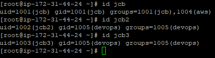
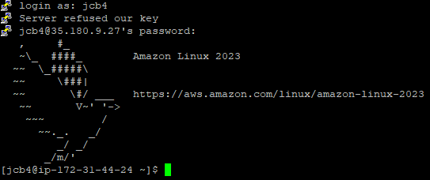

# AWS Linux Server DevOps

Following the instructions of the exersice at: [devopsrealtime.com](https://devopsrealtime.com/fun-with-linux-for-cloud-devops-engineers/)

## Create Linux based EC2 instance

1. Go to AWS Management Console and click on EC2.
2. Click on Launch Instance.
3. Amazon Linux Quick Start.
4. Create a new key pair and download it. I prefer to use a pkk key to easy connect to the instance with putty.
5. Launch the instance.

   

6. Open a terminal and connect to the instance using the pem key and the public DNS of the instance.

   

## Linux Commands

### Create users and groups as '__super user__'

1. Create users and set passwords

   `adduser jcb`

   `passwd jcb`

   Repeat the process for the other users.

   `adduser jcb2`

   `passwd jcb2`

   `adduser jcb3`

   `passwd jcb3`

2. Create Groups – devops, aws

   `groupadd devops`

   `groupadd aws`

   

3. Change primary group of user2, user3 to ‘devops’ group

   `usermod -g devops jcb2`

   `usermod -g devops jcb3`

4. Add ‘aws’ group as secondary group to the ‘user1’

   `usermod -a -G aws jcb`

   

5. Create the folowing directories

   

   We can create multiple directories with only one command.

   -p to create the parent directories if they don't exist.

   For directories with subdirectories we can use "/" to create them. For example, `dir1/f1`

   Remember to change the directory to root with the following command: `cd /`
   To create all the directories we can use the following command:

   `mkdir -p home dir1 dir2/dir1/dir2/dir10 dir3/dir11 dir4/dir12 dir5/dir13 dir6 dir7/dir10 dir8/dir9 opt/dir14/dir10`

   Now we can create the files in the directories.

   `touch f1 f2`

   `touch dir1/f1`

   `touch dir2/dir1/dir2/f3`

   `touch dir4/dir12/f4`

   `touch dir4/dir12/f5`

   `touch dir7/dir10/f3`

   `touch opt/dir14/f3`

   

6. Change group of /dir1, /dir7/dir10, /f2 to “devops” group

   `chgrp devops dir1`

   `chgrp devops dir7/dir10`

   `chgrp devops f2`

   

7. Change ownership of /dir1, /dir7/dir10, /f2 to “user1” user.

   `chown jcb dir1`

   `chown jcb dir7/dir10`

   `chown jcb f2`

   

### Create users as '__user1__'

We need to change sshd_config file to allow that user to login. Edit /etc/ssh/sshd_config file and change `PasswordAuthentication no` to `PasswordAuthentication yes`.
Restart the sshd service with the following command: `sudo service sshd restart`

We also need to add the user to the sudoers file and add permissions. Edit the file with the following command: `visudo` and add the following line at the end of the file:
`jcb ALL=(ALL) NOPASSWD: /usr/sbin/useradd, /usr/bin/passwd, /usr/sbin/groupadd, /usr/sbin/usermod, /usr/bin/chgrp, /usr/bin/chown, /usr/bin/mkdir, /usr/bin/touch, /usr/bin/mv, /usr/bin/rm, /usr/bin/ls`

Now we can login as user1 and create the users, groups, change groups, create and remove directories and files, etc. You can adapt the necessary commands to the user1 permissions.

### Login as '__user1__'

1. Create users and set passwords – user4, user5

   `sudo useradd jcb4`

   `sudo passwd jcb4`

   `sudo useradd jcb5`

   `sudo passwd jcb5`

2. Create Groups – app, database

   `sudo groupadd app`

   `sudo groupadd database`

### Login as '__user4__'

Before user4 login we need to add permissions to the user to execute commands in some directories.

Change the directory permissions, we need jcb4 user to have write permissions.

We can use the following command as root user: `chmod o+w dir6`
"o" is for others, "w" is for write.

Also we need to write permissions to the file f3 on root directory. We can use the following command: `chmod o+w /`

We need permisions to move files from one directory to another. We can use the following commands:

`chmod o+w dir2/dir1/dir2`

`chmod o+w dir1`

`chmod o+w f2`

Login as user4 with putty.

1. Create directory – /dir6/dir4

   `mkdir -p dir6/dir4`

2. Create file – /f3

   `touch f3`

3. Move the file from "/dir1/f1" to "/dir2/dir1/dir2"

   `mv dir1/f1 dir2/dir1/dir2`

4. Rename the file "/f2 to /f4"

   `mv /f2 /f4`

    

    

### Login as '__user1__'

1. Create directory – “/home/user2/dir1”

    `mkdir -p /home/jcb2/dir1`

2. Change to “/dir2/dir1/dir2/dir10” directory and create file “/opt/dir14/dir10/f1” using relative path method.

    `cd /dir2/dir1/dir2/dir10`

    `touch ../../../../opt/dir14/dir10/f1`

    

    

3. Move the file from “/opt/dir14/dir10/f1” to  user1 home directory

    `mv /opt/dir14/dir10/f1 /home/jcb`

    

4. Delete the directory recursively “/dir4”

    `rm -rf /dir4`

    

5. Delete all child files and directories under “/opt/dir14” using single command.

    `rm -rf /opt/dir14/*`

    
    
6. Write this text “Linux assessment for an DevOps Engineer!! Learn with Fun!!” to the /f3 file and save it.

    `echo "Linux assessment for an DevOps Engineer!! Learn with Fun!!" > /f3`

    
